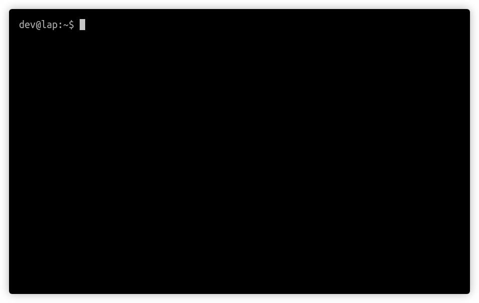

# igrepper - The interactive grepper

Filter and explore text, having the regex re-evaluated at every keypress to
minimize the feedback loop. 
Also useful for quickly developing and testing regular expressions
for other applications. 

# Installation

To install without setting up a rust environment, grab the `igrepper` binary from the
latest release: https://github.com/igoyak/igrepper/releases  
Then make it executable with `chmod` and put it in your `PATH`.

__Dependencies__

Ubuntu: `apt-get install xsel` for clipboard support

# Usage

Recommended `.bashrc` additions:

    alias i='igrepper'
    iman() {
      man "$1" | igrepper --context 3
    }

__Read input from pipe:__

    dmesg | i

__Read input from file:__

    i /etc/fstab

Create a `grep` command using `ctrl-g`: 

See context around matches: 

### Commands:

Edit the current regex by typing.

Movement: 

| Command       | Action        |
| ------------- | ------------- |
|    `Up`/`Down`/`Left`/`Right`/`PageUp`/`PageDown` | Scroll |
|    `ctrl-u`/`ctrl-d` | Half-page scroll |

Searching:

| Command       | Action        |
| ------------- | ------------- |
|    `ctrl-n`/`ctrl-j`/`Enter` | Accept current regex, start a sub-search |
|    `ctrl-p` | Revert sub-search |
|    `ctrl-i` | Toggle case sensitivity |
|    `ctrl-r`/`ctrl-t` | Decrease/Increase context-lines |

Exporting:

| Command       | Action        |
| ------------- | ------------- |
|    `ctrl-e` | Copy current match to clipboard |
|    `ctrl-g` | Copy equivalent `grep` command to clipboard |
|    `ctrl-v`/`F1` | Pipe current match to `vim` |
|    (Inside vim) `F1` | Pipe current buffer to `igrepper` (add `map <F1> :silent :w !igrepper<CR>:q!<CR>` to your `.vimrc`) |

## Supported platforms

Tested on Ubuntu 20.04

## Known issues

- No unicode support
- Broken colors when using `screen`/`tmux` and `urxvt`. Workaround: `export TERM=rxvt-unicode-256color`

## Dev dependencies

Ubuntu: `apt-get install libncurses-dev`

## Release build

`cargo build --release`

